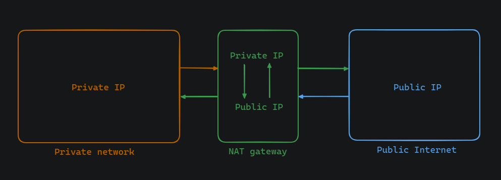

# Egress Traffic


Egress traffic denotes network traffic departing or being transmitted from a particular network or device. It encapsulates data flow from the internal network to an external network or destination. Egress traffic constitutes the outbound flow from a network or device to another network or the internet.

## Connecting a container network namespace to root network namespace
See the documentation: [Network ns and root connection](https://github.com/Minhaz00/Linux-Networking/blob/main/Network%20ns%20and%20root%20connection.md) for steps on connecting a container network namespace to the root network namespace.


## Ping 8.8.8.8 from ns0


If we execute the following command:

```
sudo ip netns exec ns0 bash
ping 8.8.8.8 -c 5
```

It appears that the network is not unreachable; rather, there might be another issue causing the problem. It's possible that packets are getting stuck somewhere along the connection.

### Problem
The source IP address, 192.168.0.2, is trying to establish a connection with Google DNS at 8.8.8.8 using its private IP address. Naturally, the external network cannot reach this private IP because it's not aware of it. Hence, although packets are reaching Google DNS, we're not receiving any responses from 8.8.8.8.

### Solution
To address the issue of private IP addresses being unable to communicate with external networks, we can employ Network Address Translation (NAT). NAT allows us to translate private IP addresses to public IP addresses, enabling communication with external networks. 



- **Set up NAT on the Router or Gateway:**
Configure NAT on the router or gateway device that connects the local network to the internet. This device will perform the translation of private IP addresses to public IP addresses. 

    Enable NAT masquerading (SNAT - Source Network Address Translation) to modify the source IP address of outgoing packets, replacing the private IP address with the public IP address assigned by the router.

    ```
    sudo iptables -t nat -A POSTROUTING -s 192.168.0.0/16 -j MASQUERADE
    ```

- **Define NAT Rules:**
Create NAT rules specifying the translation of private IP addresses to public IP addresses. These rules should map internal private IP addresses to corresponding public IP addresses.
    ```
    sudo iptables -t nat -L -n -v
    ```

- **Configure Port Forwarding (Optional):**
If specific services hosted on internal private IP addresses need to be accessed from external networks, configure port forwarding rules to forward incoming traffic from the public IP address to the corresponding private IP address and port.
    ```
    sudo iptables --append FORWARD --in-interface br0 --jump ACCEPT
    sudo iptables --append FORWARD --out-interface br0 --jump ACCEPT
    ```


