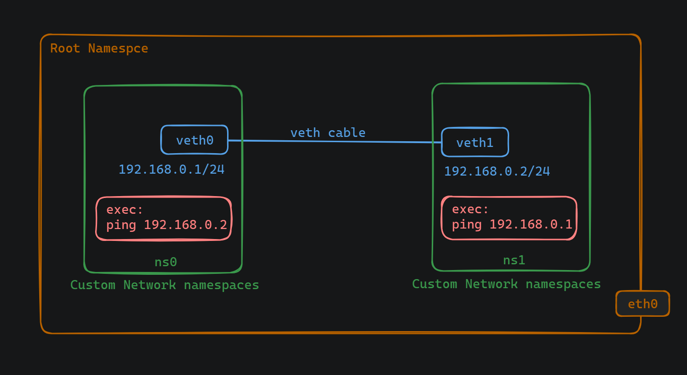

# Connect Two Custom Network Namespaces


## IP forwarding
IP forwarding is a feature of a network device that allows it to forward packets from one network segment to another. In simpler terms, it enables a computer or router to act as an intermediary, forwarding network traffic between different networks or subnets.

When we enable IP forwarding in the Linux kernel using the command `sudo sysctl -w net.ipv4.ip_forward=1` we're essentially telling the kernel to allow packets to be forwarded between different network interfaces. This is particularly useful in scenarios where we have multiple network namespaces (isolated environments) and we want them to communicate with each other. By enabling IP forwarding, we're enabling communication between these isolated environments, which can be crucial for certain networking setups, such as those used in containerized environments.


## Steps to connect two namespaces



To begin, it's necessary to enable IP forwarding in the Linux kernel. Execute the following command to enable IP forwarding:
```
sudo sysctl -w net.ipv4.ip_forward=1
```

Subsequently, we need to create and establish connectivity between two namespaces using virtual Ethernet interfaces. Following the procedures outlined in prior documentation, we create two namespaces and virtual Ethernet interfaces, configure the interfaces as network interface cards (NICs), assign IP addresses, and bring the interfaces up.


Now, to enable communication between namespaces, we set up default routes within each namespace, facilitating the routing of network traffic. Utilize the following commands to set the default routes:
```
sudo ip netns exec ns0 ip route add default via 192.168.0.1 dev veth0
sudo ip netns exec ns1 ip route add default via 192.168.0.2 dev veth1
```

With the connections established, it's crucial to verify connectivity. Test the connectivity by executing the following commands:
```
sudo ip netns exec ns0 ping 192.168.0.2
sudo ip netns exec ns1 ping 192.168.0.1
```


## Troubleshooting in LAB:

### Problem 1: Problem with test connectivity 
While I was trying to ping the network I was getting an error with the message: ping not found, no such file or directory.

Solution:

I have installed the `iputils-ping`. The iputils-ping is a package commonly found on Linux distributions that provides the ping command-line utility.


