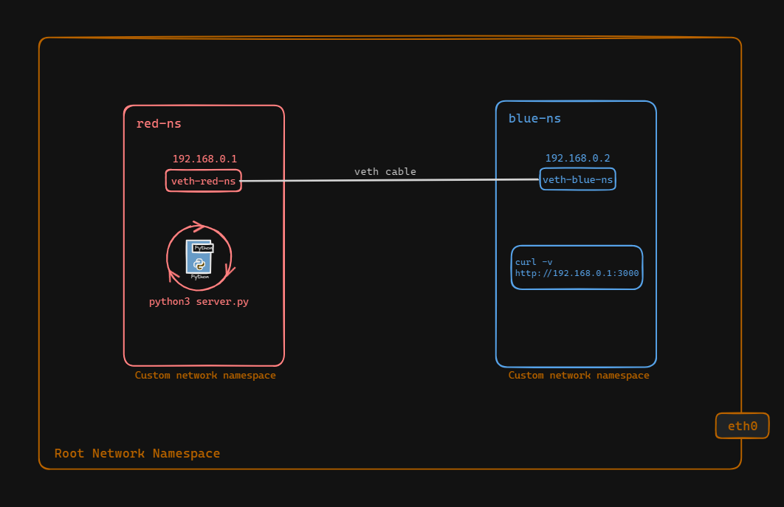

# Process Communication Between Namespaces

This guide helps us set up two separate namespaces called red-ns and blue-ns. We'll connect them using a virtual network so they can talk to each other. We'll use veth interfaces to do this. After setting up the connection, we'll make sure they can ping or request data from each other. Then, we'll create a basic Flask application in one namespace(red-ns) to say 'hello world.' Finally, we'll check if we can reach this application from the other namespace(blue-ns).


## Setup the communicating between process and different namespaces

In the previous documentations, we understood how to create namespaces and virtual ethernet link pair, set the cable as NIC, assign IP to the interfaces, set the interfaces up, set default routes within each namespace and test connectivity. Simmilarly, we will set up red-ns and blue-ns and veth interfaces with IP addresses for our purposes.




Now we can ping from one namespace to another to test connectivity using the following commands:
```
sudo ip netns exec red-ns ping 192.168.0.2
sudo ip netns exec blue-ns ping 192.168.0.1
```


Now we will create a simple python server using flask and run it from red-ns. This server runs on port `3000`.


The flask application is a simple  "hello, world!" application. We can use `vim` or `nano` to create and edit a python file. Here is the code:
```
# server.py

from flask import Flask

app = Flask(__name__)

@app.route('/')
def hello_world():
    return 'Hello, World!'

if __name__ == '__main__':
    app.run(host='0.0.0.0', port=3000, debug=True)
```


Then, to run this server we need to create virtual environment and install packages.
```
python3 -m venv venv
source venv/bin/activate
pip3 install flask
```

We need to run the server in red-ns:
```
sudo ip netns exec red-ns /bin/bash
source venv/bin/activate
python3 server.py
```


Now, we will try to connect to the server from blue-ns using curl command.
```
sudo ip netns exec blue-ns /bin/bash
curl -v http://192.168.0.1:3000
```