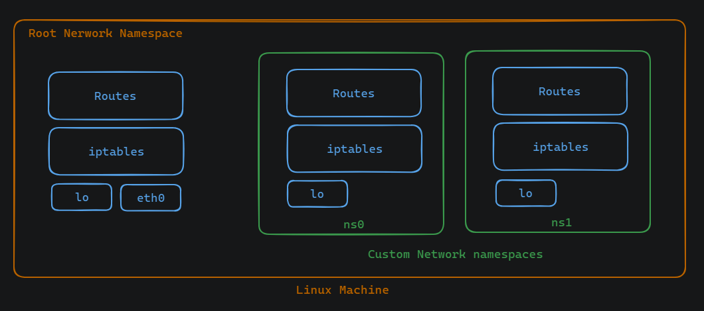

# Linux Networking and Namespaces

## Network Interfaces
Think of network interfaces as the ports of a computer that connect it to a network. Just like how a ship docks at a port to load and unload goods, a computer uses its network interfaces to send and receive data to and from the network.

### Loopback Interface (lo):
The loopback interface, represented by lo, is a virtual network interface that allows communication within a device without external network involvement. It facilitates communication between applications running on the same device. The loopback interface is vital for testing network functionality within a device and for facilitating local network communication, ensuring that network-dependent applications can function even without external network connectivity.
Example Command: `ifconfig lo`

### Ethernet Interface (eth0):
The Ethernet interface (eth0) is the primary physical network interface used for connecting a device to an Ethernet network or the internet. It handles external network communication and data transfer. The eth0 is crucial for establishing connectivity to local area networks (LANs) and wide area networks (WANs), enabling devices to communicate with other devices and access online resources.
Example Command: `ip link list`


## Routing Table
The routing table is a fundamental component of networking in Linux systems. It contains a list of rules, known as routes, that define how network traffic should be forwarded from the source to the destination. The routing table is essential for determining the optimal path for packets to reach their intended destinations, ensuring efficient and reliable data transmission across networks.
Example Command: `ip route show`

## Iptables Rules
The iptables is a powerful firewall utility in Linux used for configuring packet filter rules in the Netfilter framework. It allows administrators to define rules for packet filtering, network address translation (NAT), and packet mangling. The iptables rules are critical for network security, allowing administrators to control incoming and outgoing network traffic, block malicious traffic, and implement network policies to protect against unauthorized access.
Example Command: `iptables -L`


## Linux Namespaces
Linux namespaces are a powerful feature that allow for the creation of isolated environments within a Linux system. They are particularly useful for network management, enabling administrators to segment network resources and control access within these segments.

### What are Linux Namespaces?
Linux namespaces provide a way to partition system resources such as process IDs, network interfaces, and file systems, among others. Each namespace behaves as if it has its own instance of these resources, isolated from other namespaces on the system.

### Why Use Linux Namespaces?
- Isolation: Namespaces enable the creation of isolated environments, which is crucial for security and resource management. For example, you can create a separate namespace for a specific application, preventing it from interfering with other processes or accessing resources it shouldn't.
- Resource Management: By isolating resources, namespaces allow for more efficient resource utilization. For instance, you can allocate a dedicated set of CPU cores or network bandwidth to a particular namespace, ensuring that it has the resources it needs without impacting other parts of the system.
- Flexibility: Namespaces provide flexibility in managing system resources. You can dynamically create, modify, and destroy namespaces as needed, adapting to changing workload requirements.


### Network Namespace 
Network namespaces provide isolation for network resources such as network interfaces, routing tables, and firewall rules. This allows you to create virtual network environments, each with its own network configuration. For instance, you can create a network namespace for a development environment, enabling developers to test network configurations without affecting the production network.


### Host and Namespace
The host refers to the main operating system environment, while namespaces are isolated environments within the host. Multiple namespaces can exist simultaneously on a single host, each with its own set of resources and configurations.




### Creating a Custom Network Namespace

Create Custom Network Namespace:
```
sudo ip netns add <namespace_name>
```

List Network Namespaces:
```
sudo ip netns list
```

Enter Network Namespace:
```
ip netns exec <namespace_name>
```

Check the network interfaces inside the new ns:
```
ip link show
```

Check for iptable rules for custom ns:
```
ifconfig lo
```


