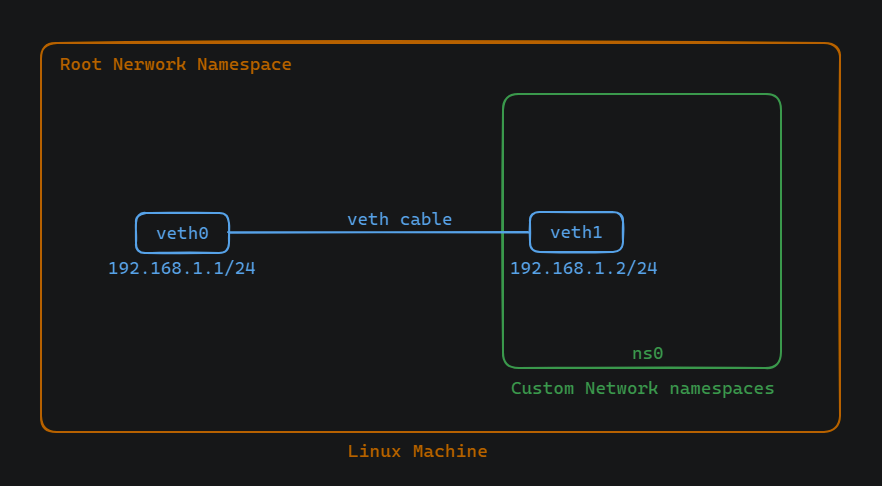

# Connecting a container to host

## Virtual Ethernet Cable

A virtual Ethernet cable, often referred to simply as a "veth pair," is a type of virtual network interface used in Linux-based operating systems to facilitate communication between network namespaces, virtual machines, or containers. In networking, it is a pair of interconnected virtual Ethernet devices or interfaces. One end of the cable is typically placed in the root namespace, while the other end is moved into a custom namespace, such as the one created for a container.

## Connecting a Container to Host Using Virtual Ethernet Cable



### Here are the steps:

1. Create Custom Namespace:
```
sudo ip netns add ns0
```

2. Create a Virtual Ethernet Cable:
```
sudo ip link add veth0 type veth peer name veth1
```

3. Move One End into the Custom Namespace:
```
sudo ip link set veth1 netns ns0
```

4. Configure IP Addresses:

On the namepace:
```
sudo ip netns exec ns0 ip addr add 192.168.1.2/24 dev veth1
sudo ip netns exec ns0 ip link set veth1 up
```

On the host:
```
sudo ip addr add 192.168.1.1/24 dev veth0
sudo ip link set veth0 up
```

5. Add a Route:
```
sudo ip route add 192.168.1.2 dev veth0
```

6. Test Connectivity:

From the host:
```
ping 192.168.1.1 -c 3
```

From the namespace:
```
sudo ip netns exec red ping 192.168.1.2 -c 3 
```


## Why Add a Route?
Without adding the route, the system wouldn't know how to reach the container's IP address (192.168.1.2). When attempting to communicate with 192.168.1.2, the system checks its routing table to determine where to send the packets. By explicitly adding a route, we instruct the system to route traffic through the veth-host interface, facilitating communication with the container.