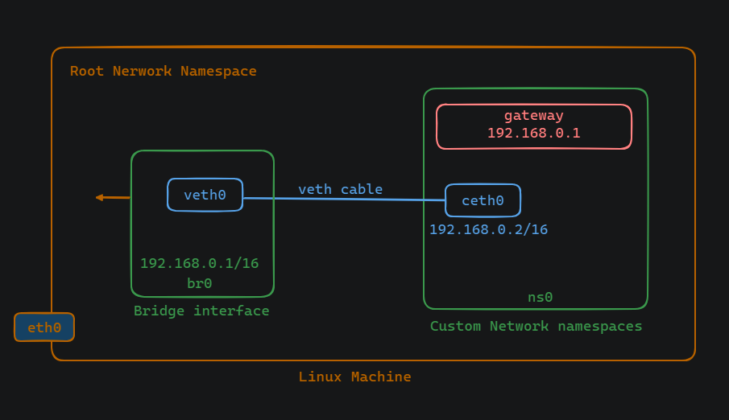

# Connecting a container network namespace to root network namespace

### Abstract
This document provides a step-by-step guide for connecting a container network namespace to the root network namespace in Linux, using custom network namespaces (ns0) and a bridge (br0). The guide includes commands for configuring the bridge interface, virtual Ethernet cable, and network namespace, as well as troubleshooting steps for common issues encountered during the process.

## Bridges in Linux Networking

In Linux networking, a bridge serves as a virtual network device that enables the connection of multiple network interfaces, effectively creating a single logical network. Bridges facilitate the connection of multiple network interfaces, allowing them to communicate with each other as if they were part of the same network segment. Create a bridge using the following command:

```
sudo ip link add <bridge-name> type bridge
```


## Steps
To connect a container network namespace to the root network namespace in Linux, several steps are involved. Initially, a custom network namespace, 'ns0,' and a bridge, 'br0,' are created. The bridge acts as a virtual network device, facilitating the connection of multiple network interfaces within a single logical network. After configuring the bridge interface and assigning an IP address, a virtual Ethernet cable is set up. This cable connects one end to a network interface card (NIC) in the 'ns0' namespace and the other end to the 'br0' interface. Subsequently, both ends of the virtual cable are activated. Within the 'ns0' namespace, the loopback interface is brought up, and an IP address is assigned to the virtual NIC. However, upon attempting communication between the 'ns0' and root namespaces, it's discovered that the network is unreachable. A check of the route table reveals that any destination IP within the specified network should be reached directly through the virtual NIC. To resolve this, a default gateway is added to the route table within the 'ns0' namespace. With the configuration completed, communication between the 'ns0' and root namespaces is successfully established.





Here are the commands:

1. Create a bridge interface and Namespace:
```
sudo ip netns add ns0
sudo ip link add br0 type bridge
```

2. Configure the Bridge Interface (br0):
```
sudo ip link set br0 up
sudo ip addr add 192.168.0.1/16 dev br0
```

3. Configure Virtual Ethernet Cable:
```
sudo ip link add veth0 type veth peer name ceth0
sudo ip link set ceth0 netns ns0
sudo ip link set veth0 master br0
```

4. Activate Virtual Ethernet Cable:
```
sudo ip netns exec ns0 ip link set ceth0 up
sudo ip link set veth0 up
```


5. Configure ns0 Namespace:
```
sudo ip netns exec ns0 ip link set lo up
sudo ip netns exec ns0 ip addr add 192.168.0.2/16 dev ceth0
```

6. Check IP Address of Primary Ethernet Interface:
```
ip addr show
```

7. Attempt Communication (Optional): [error output]
```
sudo ip netns exec ns0 bash
ping 10.0.0.25
```

8. Check Route Table:
```
route
```

9. Add Default Gateway in Route Table:
```
ip netns exec ns0 bash
ip route add default via 192.168.0.1
```

10. Test Connectivity:
```
sudo ip netns exec ns0 bash
ping 10.0.0.25 -c 5
```


## Troubleshooting in LAB:

### Problem 1: Incorrect location of Command execution 
In Step `Configure ns0 namespace` there is an issue with the command provided for configuring the network namespace (ns0). The commands should be executed from inside the ns0 namespace, but this is not explicitly mentioned in the guide.

Solution:
To resolve this issue, ensure that the command is executed from inside the ns0 namespace. The correct command sequence should be:
```
sudo ip netns exec ns0 ip link set lo up
sudo ip netns exec ns0 ip addr add 192.168.0.2/16 dev ceth0
```
By using ip netns exec ns0, we specify that the subsequent commands should be executed within the ns0 namespace, ensuring that the loopback interface is properly configured.


### Problem 2: pinging incorrect IP Address
There is a problem with the IP address used for pinging. The guide instructs to ping 10.0.0.25 without verifying if it is the correct IP address for the destination.

Solution:
To resolve this issue, it's important to verify the correct IP address of the destination host (10.0.0.25) before attempting to ping it. This can be done by using commands such as 

```
ip addr show
ifconfig
hostname -I
```
You can use any one of this command to find IP. Once the correct IP address is determined, update the ping command accordingly.

```
sudo ip netns exec ns0 bash
ping <correct_IP_address> -c 3
```